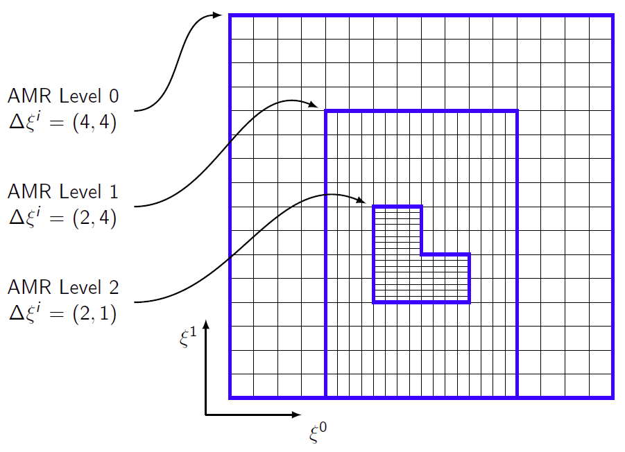

Block-structured AMR primer
===========================

Introduction
------------

Understanding the ins and outs of adaptive mesh refinement is by no means trivial. In SOMAR, we've tried to automate things to the point that you can just change some input file parameters and watch the grids adapt as your simulation runs. But are you sure you are maximizing efficiency? Are you sure you are refining where you need to refine? Do you even need to use AMR or are you just making things complicated for yourself? Perhaps static mesh refinement is good enough. With these issues in mind, let's look at the basics of SOMAR's adaptive algorithm -- when to use it, where to use it, and how the different levels of refinement work with each other.

What does "block-structured" mean?
----------------------------------

"Block-structured" means that we cannot refine a single point. If ``amr.blockFactor = 16``, then the fine level's grids will be made of boxes that have at least 16 cells on a side. This leads to an inefficiency since more cells will be refined than were requested. This is not always a bad thing. First of all, underresolved cells are usually clustered, so refining an entire box that encloses the cluster can be quite practical. Second, iterating over a set of disjoint cells is rarely as efficient as iterating over a box of cells because rectangular boxes have simple dimensions that your processor's prefetch cache can use to its advantage. Third, if you find a feature that needs refinement, it's usually a good idea to refine additional surrounding cells to prevent the feature from advecting back into unrefined territory.

.. .. figure:: img/AdvTest4Lev_t00_GridsLevels_Cropped2.png
..     :width: 800
..     :alt: Block-structured AMR.

..     2D block-structured AMR with four levels of refinement. The *refinement ratio* between levels is 4-by-4. This means each time we refine, coarse cells are broken into 16 finer cells. The pseudocolor plot deptics an unphysical scalar field.

.. _fig_AMRGrids:

    2D block-structured AMR with three :term:`levels<level>` of refinement.

Having said this, there are variants of AMR on structured grids that can refine individual cells, such as quadtrees in 2D or octrees in 3D. But the capability is often used to restrict the refined regions to a very tight region around complex obstacles, not to refine individual cells.

What gets refined?
------------------

Part of the difficulty with AMR is correctly identifying underresolved patches of the domain. There are several black-box solutions that are commonly used. These include, but are not limited to, calculating

- undivided differences of state variables,
- vorticity, and
- error via Richardson extrapolation.

Of these options, undivided differences are the simplest. Given any discretized state variable, :math:`q`, we compute the jumps between adjacent cells. If the magnitude of the jump is above some threshold, we tag both cells for refinement. A nice detail of this tagging method is that :math:`|\Delta q|` will decrease with resolution. The downside of the method is that it is often difficult to identify proper thresholds for each state variable, as they depend on the physics of the flow.

.. todo::
    Tagging on vorticity

Tagging on the error computed via Richardson extrapolation is detailed in (CITE Dan Martin), but is not current implemented in SOMAR.

There are also methods that are specialized to the physics being studied. For example, turbulence in a stratified flow is expected when the gradient Richardson number, defined as the ratio of the local stratification to the horizontal shear squared, becomes less than 0.25 (CITE: Miles, 1961; Howard, 1961). In practice, we tag those cells that satisfy :math:`\text{Ri} \leq \mathcal{O}(1)` in anticipation of turbulence. Unlike other tagging strategies, this strategy is robust in the sense that the tolerance is flow-independent. We can use the same threshold, :math:`\text{Ri} \leq \mathcal{O}(1)`, for all stratified flows and expect satisfactory results.

Some disturbances effect the entire water column. An internal solitary wave is a good example. In this case, an option is to project the buoyancy deviation, :math:`b'(x,y,z,t) = b(x,y,z,t) - \bar{b}(z)`, onto the vertical structure function

.. math::

    A(x,y,t) = \int b'(x,y,z,t) \, \varphi_0(z) \, dz,

where the integral is evaluated over the vertical domain extent. We can then increase the resolution over entire vertical sections where :math:`|A(x,y,t)|` exceeds some threshold. This method was used successfully in (CITE 2015 paper).

.. Static mesh refinement (SMR)
.. ----------------------------

.. With SMR, you choose the grid structure at the start of your simulation and it remains constant. This is simpler than AMR because there is no mystery. You do not need to predict/detect where refinement is needed and you can carefully set up your grids to be easily distributed over your MPI ranks. As a bonus, you can run just a few timesteps and learn exactly how efficient your setup is. In contrast, adaptive mesh refinement may run quickly at first, but then refine a large percentage of the domain, causing the simulation to slow down or the system to thrash. Use SMR when

.. * you know exactly where the refinement is needed,
.. * these locations will never change, and
.. * the fine grids only cover a small fraction of the underlying coarse grids (about 10%).

.. In SOMAR, you can turn on SMR by first overloading either ``AMRNSLevel::tagCellsInit`` or ``AMRNSLevel::tagCells``, then setting ``amr.regridIntervals`` to a very large number. The latter tells SOMAR how many timesteps to go between regrids. By setting this to a very large number, we prevent regridding altogether, avoiding unnecessary overhead. We will discuss implementation details in :doc:`new_amr_sim`.

.. The lifecycle of an AMR level
.. -----------------------------

.. .. graphviz::

..     digraph example {
..         node [fontname = "Helvetica-Outline"];
..         edge [fontname = "Helvetica-Outline"];

..         splines = false;

..         newgrids [
..             label = "Restructure or\ncreate new grids";
..             shape = rect;
..         ];

..         interp [
..             label = "Interpolate data up\nto new fine patches";
..             shape = rect;
..         ]

..         proj [
..             label = "Project\ncomposite data";
..             shape = rect;
..         ]

..         pinit [
..             label = "Generate new\npressure estimate";
..             shape = rect;
..         ]

..         labelloc="t";
..         label="Level initialization";

..         newgrids -> interp;
..         interp -> proj;
..         proj -> pinit;

..         {
..             rank=same;
..             newgrids; interp; proj; pinit;
..         }
..     }

.. .. image:: img/SubcycledTimestep.png
..     :scale: 100 %
..     :alt: A schematic of a single, composite (subcycled) time step.
..     :align: center

.. .. .. figure:: img/SubcycledTimestep.png
.. ..     :scale: 100 %
.. ..     :alt: A schematic of a single, composite (subcycled) time step.

.. ..     A schematic of a single, composite (subcycled) time step. The composite timestep shown here requires 4 single-level timesteps (represented by 4 right-pointing arrows), each taken in an order shown by the blue numbers above each arrow. Viewed as a predictor-corrector method, the composite timestepping algorithm first computes a coarse level prediction of the state at time tn+1, then generates a finely resolved correction. Once the coarse and fine level solutions arrive at tn+1, they must be synchronized.

Should I use AMR?
-----------------

Whether or not you should use AMR in your project is, of course, dependent on what you are trying to simulate. We've tried to make SOMAR's adaptive capabilities easy to turn on and tweak. This way, once you create a single-level simulation, you can easily experiment with the adaptive capabilities. So, my advice is to follow the guidelines below, and if you think you may benefit from AMR, start with a slightly unresolved simulation on a single level, then try adding adaptive grids to achieve your goals. If you end up deciding against adaptive grids in favor of global refinement, you can make it so right from your input file.

**Do not use AMR if...**

- you need to resolve the entire bottom boundary layer. Try grid stretching instead.
- the features that require high resolution are not localized. The overhead of AMR is only efficient when a small fraction of the domain is refined.

**Use AMR if...**

- providing global resolution would require too much memory.
- providing global resolution would make the simulation intractible.
- the fine-scale features are highly localized in space and/or time.
- you need to provide some extra resolution for a localized LES or non-linear interaction.
- to increase resolution near small-scale features of an immersed boundary.
- to increase resolution near a small portion of a boundary layer that is known to generate small-scale features, such as the generation site of an internal wave.

.. Advice...
.. Linear data (mass, momentum) can be averaged down and summed.
.. Non-linear data (energy) needs care. E must be computed on all levels, then averaged down.
.. Integrals can be tricky (show staircase phenomenon). Issue when performing baroclinic energy budget. Perform global evaluations on level 0, then interpolate up.
.. Distinguish global from local fields. Global fields should be resolved at level 0. Do not try to gain resolution via AMR or recalculate on a fine patch. Just interp up.
.. Conservative vs. non-conservative interpolation.

Glossary
--------

.. glossary::
    level
        A collection of grids and data at a specific resolution. Figure :numref:`fig_AMRGrids` shows three distinct levels. Note that only the level 0 spans the entire computational domain.

    composite
        The collection of :term:`valid` grids or data over the entire AMR hierarchy.

    refinement ratio
        The amount of refinement between two levels. In figure :numref:`fig_AMRGrids`, the refinement ratio between levels 0 and 1 is (2,1) and the refinement ratio between levels 1 and 2 is (1, 4).

    block factor
        The minimum size of a single grid. Small values allow you to keep refinement tight around an obstacle or feature. Large values allow the multigrid Poisson solver to achieve deeper V-cycles, potentially speeding up the simulation.

    grid buffer
        Block structured AMR does not allow us to jump multiple levels at a single :term:`coarse-fine interface<coarse-fine interface (CFI)>`. Notice in figure :numref:`fig_AMRGrids`, levels 0 and 2 to not directly touch -- level 1 provides a buffer region between them.

    composite timestep
        A complete timestep taken by a level and all of uts overlying finer levels.

    subcycling
        A level's maximum allowable timestep is linked to its resolution -- finer resolutions require smaller timesteps. When subcycling, each level takes the largest timestep it can, without being restricted by the timestep of its overlying finer levels. Subcycling allows an AMR simulation to be refned in time as well as space.

    coarse-fine interface (CFI)
        In an N-dimensional simulation, the coarse-fine interfaces is the (N-1)-dimensional regions where two different resolutions meet.

    ghost layer
        A halo of cells around a grid that are used to help enforce boundary conditions or perform data exchanges among neighboring MPI ranks. Second-order derivative and interpolation stencils typically only require one ghost layer, but higher-order stencils can use more.

    valid
        The collection of a :term:`level's<level>` cells/data that is not in a :term:`ghost layer` and is not covered by finer cells/data.

    invalid
        The collection of cells that are not in :term:`valid` regions. These cells are either covered by finer grids or exist in :term:`ghost layers<ghost layer>`.

    layout
        An arrangement of boxes that composes a single level.

    patch/box/grid
        These terms are interchangeable. They represent a single, rectangular collection of cells. In :numref:`fig_AMRGrids`, levels 0 and 1 may be made of one or more grids, but level 2 must me made of at least two grids.

    effective resolution
        If we construct our adaptive grids appropriately, applying adequate resolution to all key features of a simulation, then the results should be equivalent to a single-level simulation at the finest level's resolution. This is the effective resolution. It is equivalent to the base resolution times all of its refinement ratios. The effective resolution of a simulation using the grids in figure :numref:`fig_AMRGrids` would be 32-by-64.

    average down
        Fine-level data is typically assumed more accurate than coarse-level data. We often need to correct the coarse-level data by interpolating the fine data down to the coarse-level's grids wherever it is available. The simplest and most useful interpolation scheme is to replace each coarse-level cell with an average of the data in the overlying fine level cells. This is often needed at the end of a :term:`composite timestep` when :term:`synchronizing<synchronization>` levels, or during the coarsening phase of a V-cycle.

    interpolate up
        Given a coarse-level of data, we can use a constant, linear, or quadratic interpolation scheme to fill the overlying fine level where it exists. This is often needed when a new fine level grid appears and needs to be :term:`initialized<initialization>` with data, or during the prolongation phase of a V-cycle.

    refluxing
        The AMR timestepping scheme can be viewed as a predictor-corrector method. First, the coarse level is timestepped to produce a prediction of the final state. Then, the fine levels are timestepped to produce more accurate corrections. These corrections usually push more or less fluid through the :term:`CFI<coarse-fine interface (CFI)>` than was predicted by the coarse level. Refluxing corrects these inconsistencies by computing the flux mismatches at the :term:`CFI<coarse-fine interface (CFI)>` and adding or removing heat/salt/mass/scalar concentrations from adjacent coarse cells.

    tagging
        The process of identifying which of a level's cells require refinement. If no cells are tagged, then the finer level is either destroyed or not created. If cells are tagged, then SOMAR will ensure that the resulting fine level's :term:`layout` will be created or changed to include every tagged cell.

    initialization
        Once a fine level is created or changed, its new regions will require accurate data -- the level needs to be initialized. This is a three-step process. First, we :term:`interpolate up` from the coarse level to the new, empty regions. Second, we project the new velocity field to enforce the incompressibility constraint. Third, we run a very small timestep on the new level to generate a smooth pressure estimate. This last step can be made fast by increasing the tolerance of the pressure Poisson solver and using a forward Euler scheme.

    synchronization
        Once two or more levels are timestepped and reach the same time, they need to be synchronized. First, we :term:`reflux<refluxing>` all cell-centered scalar fields to ensure global conservation. Second, we project the velocity on all synchronizing levels to enforce incopressibility at the :term:`CFI<coarse-fine interface (CFI)>`. Third, we correct all :term:`invalid` data by :term:`averaging down<average down>` from the finest to the coarsest synchronizing levels.
