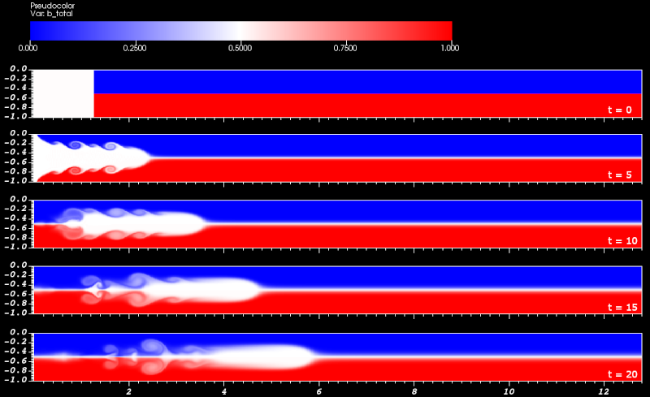
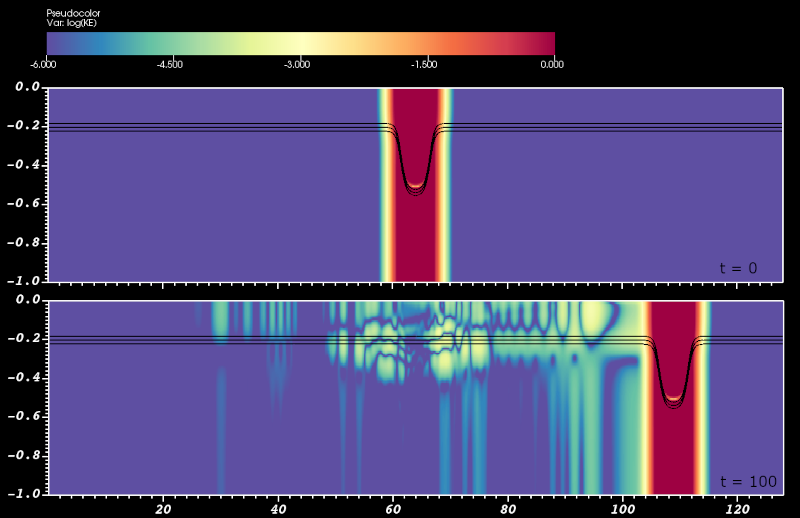

Creating single-level simulations
=================================

..    include:: <isonum.txt>

Starting from scratch
---------------------
All simulations should be placed in the :code:`exec` folder. To begin setting up a new simulation, use the :code:`spawn` shell script. For example, suppose you want to create a 2D internal wave simulation on a computer with 16 available processors.

.. code-block:: console

    $ cd exec
    $ ./spawn MyFirstProject

This will create a :code:`somar/exec/MyFirstProject` folder that is populated with several files that are ready to compile and run. To compile the default code with the GCC compiler suite, do the following.

.. code-block:: console

    $ cd MyFirstProject
    $ ./buildall -j32 --D=2 --Serial

Although our computer has 16 available processors, we may have 2 threads per core, so we request twice as many simultaneous jobs when compiling with the :code:`-j32` option. If you wish to use the Intel or Clang compiler suites, add the :code:`--IntelCompiler` or :code:`--Clang` flags to the :code:`buildall` command.

If all goes well, an executable will be created named :code:`Somar_2D.Serial.gcc.ex`. By default, this simulation will not do much because the initial state will be set to zero. Nevertheless, we should run it just to be sure everything is working.

.. code-block:: console

    $ ./Somar_2D.Serial.gcc.ex inputs.template.machine > std.out

Within :code:`std.out`, we should see some convergence metrics, energy calculations, and so on. We will sort much of this out later. For now, you should check that the file concludes as expected.

.. code-block:: none

    ########################### AnisotropicAMR::conclude ###########################
    checkpoint file name = check_points/chkpt_000001.2d.hdf5
    number of points updated at level 0 = 4096
    total number of points updated = 4096

If so, SOMAR is properly set up on your system for serial runs.

If MPI is available on your system, the compilation process is similar. In fact, there are only 2 changes that need be made. First, MPI is the default mode, so remove the :code:`--Serial` flag from the build line. Second, the executable will have a slightly different name.

.. code-block:: console

    $ ./buildall -j32 --D=2
    $ mpirun -np 16 ./Somar_2D.MPI.gcc.ex inputs.template.machine

You can still pipe the standard output to a file, but there is less need to do so in MPI mode as most of the information will be written to files for us. SOMAR now generates several :code:`pout.*` files, one for each MPI rank. This is where Poisson solver convergence info and other diagnostic information will be written. The terminal will only display very basic info to let you know how far along the simulation has progressed.

Setting the EoS and initial conditions
--------------------------------------
The main C++ class used by SOMAR is the :code:`AMRNSLevel` class. A class is just a collection of data and functions, and :code:`AMRNSLevel` contains all of SOMAR's state data and functions that help compute the RHS of the Navier-Stokes equations. A peek inside :code:`somar/src/Grade5_SOMAR/AMRNSLevel.H` will reveal a wealth of functionality. Do not get overwhelmed! Most simulations override the same handful of functions. As you learn to use SOMAR, you'll find that you typically just need to set initial and boundary conditions, set a permanent background stratification, adjust the equation of state, and perhaps, add some scalars or a forcing function. Over time, you'll end up becoming very familiar with a common set of functions and learn to ignore the rest. For now, we will direct our attention to just two commonly used functions, :code:`equationOfState` and :code:`setICs`.

Customizing the EoS
^^^^^^^^^^^^^^^^^^^

Let's set up a simple two-layer internal wave simulation with lighter fluid on top, heavier fluid on the bottom, and a mixed region on the left. The mixed layer will push its way across the domain between the lighter and heavier fluid.

SOMAR does not deal with density directly. Instead, we need to specify the initial temperature and salinity so that SOMAR can compute the reduced gravity via an equation of state, :math:`b = g(\rho-\rho_0)/\rho_0 = \Gamma(T,S)`. By default, SOMAR uses the linear equation of state

.. math::

    \begin{align*}
        \Gamma(T,S) &= -\alpha g T + \beta g S\\
        \alpha &= 2.0\times 10^{-4}\,\rm{K}^{-1} \\
        \beta &= 8.0\times 10^{-4}\,\text{psu}^{-1}\\
        g &= 9.81\,\rm{m}/\rm{s}^2.
    \end{align*}

.. warning::
    Technically, buoyancy is defined as the *negative* of our reduced gravity. Nevertheless, we will call :math:`b = g(\rho-\rho_0)/\rho_0 = \Gamma(T,S)` the buoyancy field. Keep this in mind when greating custom equations of state!

For our example, we want to abandon this default EoS and let the temperature be a proxy for the buoyancy by setting :math:`\Gamma(T,S) = T`. To do this, we must override the :code:`equationOfState` function by placing the following code in your :code:`UserPhysics` class within the :code:`UserPhysics.H` file.

.. code-block:: C++

    /// Our custom EoS. This simply sets b = T.
    virtual void
    equationOfState(FArrayBox&       a_bFAB,
                    const FArrayBox& a_TFAB,
                    const FArrayBox& a_SFAB,
                    const FArrayBox& a_zFAB) const override
    {
        a_bFAB.copy(a_TFAB);
    }

.. note::
    In C++, it is considered good practice to split the declaration and implementation of a function. There are a few exceptions to this rule. One exception is when the function implementation is very small (one or two lines long). Defining a small function within its declaration *might* allow the compiler to inline the function and eliminate the call, bringing pros and cons that are beyond the scope of this tutorial.

Setting the ICs
^^^^^^^^^^^^^^^

Next, we turn to the initial conditions. Because all simulations need initial conditions, the :code:`setICs` function was created for you by the :code:`spawn` utility. Open :code:`UserPhysics.cpp` and update the :code:`setICs` as follows.

.. code-block:: C++

    void
    UserPhysics::setICs(State& a_state)
    {
        // NOTE:
        // In this simple example, remember that there is no temperature.
        // T is just a proxy for b. That is why we fill T with b values!
        // In other words, we set a_state.T with b_total!

        // As is, our code will only work in 2D.
        CH_verify(SpaceDim == 2);

        // Gather geometric info.
        const DisjointBoxLayout& grids = m_levGeoPtr->getBoxes();
        const Real               L     = m_levGeoPtr->getDomainLength(0);
        const Real               x0    = 0.1 * L;
        const Real               z0    = -0.5;

        // Loop over each grid in the layout...
        for (DataIterator dit(grids); dit.ok(); ++dit) {
            // Create references to this grid and this grid's data holder.
            const Box valid = grids[dit];
            FArrayBox& TFAB = a_state.T[dit];

            // Loop over each cell in the grid...
            for (BoxIterator bit(valid); bit.ok(); ++bit) {
                const IntVect& iv = bit();
                const Real     x  = m_levGeoPtr->getCellX(0, iv);
                const Real     z  = m_levGeoPtr->getCellX(1, iv);

                // The vertical structure.
                if (z > z0) {
                    TFAB(iv) = 0.0;
                } else {
                    TFAB(iv) = 1.0;
                }

                // The mixed region.
                if (x < x0) {
                    TFAB(iv) = 0.5;
                }
            }
        }
    }

This should compile and run without issue, but we still have a few more details we need to address. Our interface location of :math:`z_0 = -0.5` is meaningless until we set up the computational domain. This can be done in the input file.

The input file
--------------
The :code:`spawn` utility automatically populates your input file template with an organized list of tweakable parameters. Most of them are commented out using the :code:`#` character. When a parameter is commented out, we allow SOMAR to use a default value. For example, your input file contains this line.

.. code-block:: python

    # time.maxDt = 0.5      # [1.0e8]

The :code:`#` character at the start of the line ensures :code:`amr.maxDt` is not read from this input file and the default value of 1.0e8 (shown at the right) is used. If we uncomment this line, we can manually set a more reasonable value. All parameters whose line ends with :code:`# MUST SPECIFY` have no default value. Be sure to set these values.

The input file is divided into groups, or prefixes. Each prefix controls a different aspect of your simulation.

+--------+----------------------------------------------------------------------------------------------+
| Prefix | What it controls                                                                             |
+========+==============================================================================================+
| base   | Base level geometry, resolution, and decomposition details.                                  |
+--------+----------------------------------------------------------------------------------------------+
| time   | Time stepping controls -- dt limits, max number of steps, restart details, etc.              |
+--------+----------------------------------------------------------------------------------------------+
| output | Controls plots, checkpoints, and other diagnostic info.                                      |
+--------+----------------------------------------------------------------------------------------------+
| amr    | Adaptive refinement controls.                                                                |
+--------+----------------------------------------------------------------------------------------------+
| rhs    | Model parameters -- viscosity/diffusivities, BCs, forcing toggles, LES controls, etc.        |
+--------+----------------------------------------------------------------------------------------------+
| proj   | Projector parameters -- conergence tolerance, multigrid and relaxation details, etc.         |
+--------+----------------------------------------------------------------------------------------------+
| strat  | Background stratification parameters.                                                        |
+--------+----------------------------------------------------------------------------------------------+
| ib     | Immersed boundary parameters.                                                                |
+--------+----------------------------------------------------------------------------------------------+

Knowing this, let's set up our 2D internal wave simulation using a channel with dimensions :math:`(12.8, 1)`, with the top and bottom located at :math:`z = 0` and :math:`z = -1`, respectively. To resolve the flow, we will discretize the domain into :math:`(1024, 128)` cells and increase the viscosity/diffusion to :math:`10^{-4}`. Once the flow begins, SOMAR will compute that the maximum stable timestep is approximately 0.02, limited by the advection scheme. To be on the safe side, we will scale this by 0.9.

.. note::
    I am not attempting to provide scales that are physically relevant in any way, so I will not include units unless there is an elucidating reason to do so.

In your input file, locate and set the following parameters.

.. code-block:: python

    #------------------- Base level geometry and decomposition --------------------#
    base.L               = 12.8 1.0    # MUST SPECIFY
    base.nx              = 1024 128    # MUST SPECIFY
    base.nxOffset        = 0 -128      # [0 0 0]
    base.maxBaseGridSize = 256 64      # MUST SPECIFY
    base.blockFactor     = 32          # MUST SPECIFY

    #---------------------------- Timestepping details ----------------------------#
    time.stopTime        = 100.0
    time.maxSteps        = 2000
    time.maxDt           = 0.1         # [1.0e8]
    time.dtMult          = 0.90        # [0.80]

    #------------------------------ Model parameters ------------------------------#
    rhs.nu               = 0.0001      # [0.]
    rhs.TKappa           = 0.0001      # [0.]

Using :code:`base.L` and :code:`base.nx`, we can calulate the cell sizes along with the physical coordinates of the nodes and cell-centers.

.. math::
    :label: eq:SimpleCartCoords

    \begin{align*}
        (\Delta x, \Delta z) &= (0.0125, 0.0078125) \\
        (x_i,z_j)_{\rm{nodes}} &= (i\Delta x, j\Delta z) \\
        (x_i,z_j)_{\rm{cells}} &= ((i+1/2)\Delta x, (j+1/2)\Delta z)
    \end{align*}

.. warning::
    These formula are only true in a simple, unstretched, Cartesian coordinate system. We will revisit these formulas when we introduce grid stretching.

:code:`base.nxOffset`
^^^^^^^^^^^^^^^^^^^^^
In 2D, each cell has 4 vertex nodes. The node at the lower left of each cell shares its index with the cell-center. Notice that :math:`z=0` is at the :math:`j=0` nodes, which is why we vertically shift the domain using :code:`base.nxOffset`. This can be a point of confusion, so let's elaborate.

By setting :code:`base.nxOffset = 0 -128`, we shift the *cell* indices from :math:`(i,j)_{\rm{cells}} = (0,0)..(1023, 127)` to :math:`(0,-128)..(1023, -1)`. Similarly, the *nodal* indices shift from :math:`(i,j)_{\rm{nodes}} = (0,0)..(1024, 128)` to :math:`(0,-128)..(1024, 0)`. So, by vertically shifting the domain, the bottom nodes are at :math:`z_{-128} = -128 \Delta z = -128 \cdot (1/128) = -1.0` and the top nodes are at :math:`z_{0} = 0 \cdot \Delta z = 0`.

:code:`base.blockFactor`
^^^^^^^^^^^^^^^^^^^^^^^^
Solving the pressure Poisson problem at each Runge-Kutta stage is the most time-consuming operation in any incompressible fluid solver. In SOMAR, we use several techniques to speed up its convergence and ensure its solution's accuracy. For now, we will only discuss one technique -- *geometric multigrid with semicoarsening*, or MG for short. Unless your simulation is *leptic*, meaning :math:`H < \Delta x`, MG will be the SOMAR's default solution method.

In order for MG to work properly, it needs to be able to coarsen the grids by factors of 2. If :math:`\Delta x \approx \Delta z`, then MG will coarsen in all directions. If the grids are anisotropic, then MG will coarsen in a way that promotes isotropy. For example, our grids have :math:`(\Delta x, \Delta z) = (0.0125, 0.0078125)`, so MG will decide to first only coarsen in the vertical, bringing us to :math:`(\Delta x, \Delta z) = (0.0125, 0.015625)`. At this point, the grid scales are roughly the same, so from here on, SOMAR will coarsen in all directions to preserve isotropy.

In theory, the coarser MG can go, the more efficient and accurate the pressure Poisson solver will be. In practice, coarsening creates overhead, and coarsening down to a 1-by-1 grid is more expensive than necessary. Worse yet, the Laplacian's stencil would not have enough room to accurately compute curvatures. (Does curvature even exist on a grid this coarse?) We found that most benefits are achieved when MG can coarsen enough to achieve isotropy and then at least two times further. Therefore, it is not necessary (and ill-advised) to coarsen down to a 1-by-1 grid. The :code:`base.blockFactor` input parameter controls how coarse a grid can be. If we set :code:`base.blockFactor = 16`, then MG will coarsen until one of the domain's grids has 16 cells on a side. We suggest setting this parameter to 16 or 32 for most simulations.

:code:`base.maxBaseGridSize`
^^^^^^^^^^^^^^^^^^^^^^^^^^^^
In a HPC environment, we have two competing needs. On one hand, we want to use as many processors as possible, which requires decomposing the domain into many small grids. On the other hand, we want to give MG enough room on each grid to facilitate coarsening. The :code:`base.maxBaseGridSize` input file parameter is our way of telling SOMAR how to make this compromise. Suppose we want to run our :math:`(1024, 128)` simulation on four processors. Let's consider each option.

.. code-block:: python

    maxBaseGridSize    number of grids in each direction
    ----------------------------------------------------
    256  128           4 1
    512  64            2 2
    1024 32            1 4

Of these options, the first would perform best (although, it may be hard to tell since all three would be very fast in a 2D simulation). To see why, let's set :code:`base.maxBaseGridSize = 256 128` and :code:`base.blockFactor = 32`. This would lead to the following MG coarsening schedule.

.. code-block:: python

    MG depth    grid Nx  grid Nz    dx       dz           refinement   isotropic
    ----------------------------------------------------------------------------
    0           256      128        0.0125   0.0078125    --           No
    1           128      128        0.0125   0.015625     (2,1)        Yes
    2           64       64         0.025    0.03125      (2,2)        Yes
    3           32       32         0.05     0.0625       (2,2)        Yes
    Our blockFactor prevents further coarsening.

Notice that this choice does several things. First, our 1024-by-128 domain is decomposed into four grids, each with an equal size of 256-by-128 at MG depth 0. The simulation is *load balanced*. Second, we coarsen twice after reaching isotropy, making MG roughly as efficient as possible. Third, the coarsest grids have the same number of cells in all directions. This is not mandatory, but tells us that we've done a good job. If the coarsest grid was, say, 128-by-32, then MG would need to stop coarsening because of `Nz`, wasting the opportunity to coarsen in the horizontal.

Feel free to play with these parameters. Try setting :code:`base.blockFactor` to different values to see how it effects the simulation speed. And remember, what causes a small speedup in 2D may cause a drastic speedup in 3D!

One last point about resolution and load balancing. Our domain is discretized into 1024-by-128 cells. Setting :code:`base.maxBaseGridSize = 256 128` and :code:`base.blockFactor = 32` results in a balanced load if we use 1, 2, or 4 MPI ranks / processors. If you choose a number of processors that does not allow a balanced load, a warning will be emitted at the start of the simulation. (Try it!) Choosing appropriate settings to obtain fast and balanced simulations is tricky, especially when AMR or lepticity is involved. We will save these more advanced topics for later.

Visualizing the output
----------------------
By default, the output will be written to the :code:`hdf5_output` folder within your project folder. If you'd like to change the default location or change the amount of data generated, change the following parameters.

.. code-block:: python

    output.plotInterval    = 1                   # [-1]       MUST SPECIFY THIS
    output.plotPeriod      = -1.0                # [-1.0]     OR THIS!
    output.plotPrefix      = hdf5_output/plot_   # [plot_]

The :code:`output.plotPrefix` setting controls *where* to save the data relative to the simulation's working directory. In this example, the files will be named :code:`plot_000000.2d.hdf5`, :code:`plot_000001.2d.hdf5`, :code:`plot_000002.2d.hdf5`, and so on. The other two parameters control *when* to save data.
For example, setting :code:`output.plotInterval = 1` will emit a data file at each timestep. Setting this to 5 will emit a data file every 5 timesteps. Setting :code:`output.plotPeriod = 0.25` will emit a data file at :math:`t = 0.0s, 0.25s, 0.50s, 0.75s, \dots` Typically, you would set one or the other, but not both.

The data is written to `HDF5 <https://www.hdfgroup.org/solutions/hdf5/>`_ files in a format that is native to the Chombo library that forms the backbone of SOMAR. These files can be opened and visualized using `VisIt <https://visit-dav.github.io/visit-website/index.html>`_.

Open visit, click File |rarr| Open file, and a dialog box will appear. Navigate to your data's directory and ensure "Smart grouping" is checked. This will allow you to open the entire time series of data. Click OK and you'll notice the "Active Source" is set to the :code:`plot_*.hdf5 database`. Next, we need to choose how to view our data. Let's take a look at the reduced gravity (called buoyancy in SOMAR). Click the Add |rarr| Pseudocolor |rarr| b_total, then click "Draw". An image of the initial conditions should appear in the visualization window. To move to another timestep, adjust the "Time" slider. For more information about how to visualize data in VisIt, feel free to play around or go to the `VisIt website <https://visit-dav.github.io/visit-website/index.html>`_.

Importing data from Matlab
--------------------------
Next, let's convert our simple internal wave simulation to model an internal solitary wave of depression traveling to the right in a continuously stratified fluid.  The theory behind these waves are by no means trivial and the reader is encouraged to read [StastnaLamb2002]_ for details. For the purposes of this tutorial, the initial conditions are provided in a text file that can be read by SOMAR. You can download the file :download:`here<resources/DJLIC.tar.bz2>`.

Reading initial conditions from a data file is such a common task that SOMAR provides the :code:`IO::readASCII` function to help. This function can read space/new-line separated data from a text file and store it in either a :code:`std::vector` or a :code:`LevelData<FArrayBox>`. For example, here is how to read the first 20 real numbers from :code:`MyDataFile.txt`. The first 12 will be placed into :code:`v1` and the remaining 8 will be placed into :code:`v2`.

.. code-block:: C++

    #include <IO.H> // At top of file.

    // ...

    // Open the input file
    const std::string filename("MyDataFile.txt");
    std::ifstream inFile(filename);
    if (!inFile.is_open()) {
        MAYDAYERROR("Could not open file " << filename << ".");
    }

    // Read the first 12 real numbers.
    std::vector<Real> v1(12);
    IO::readASCII(v1, inFile);

    // Read the next 8 real numbers.
    std::vector<Real> v2(8);
    IO::readASCII(v2, inFile);

    // We are done.
    inFile.close();

To read a 2D or 3D array of data, the code is similar. This snippet shows how to read cell-centered velocity components from the file.

.. code-block:: C++

    // Read an entire domain of CC velocity data.
    LevelData<FArrayBox> ccVel(grids, SpaceDim);
    for (int velComp = 0; velComp < SpaceDim; ++velComp) {
        IO::readASCII(ccVel, velComp, inFile);
    }

.. warning::
    Behind the scenes, :code:`IO::readASCII` reads the data on a single processor, then distributes the data onto your processor layout. So, remember that this is a serial operation that should be called sparingly!

In SOMAR, velocity components are face-centered and all other scalars are cell-centered (SOMAR uses Arakawa-C grids. See: [ArakawaLamb1977]_). This means we need to recenter the velocity components. Typically, we do this by filling a ghost layer, then using standard second-order averages.

.. code-block:: C++

    // At top of file.
    #include <BCTools.H>
    #include <Convert.H>
    #include <IO.H>

    // ...

    // Read CC vel.
    LevelData<FArrayBox> ccVel(grids, SpaceDim, IntVect::Unit);
    for (int velComp = 0; velComp < SpaceDim; ++velComp) {
        IO::readASCII(ccVel, velComp, inFile);
    }

    // Extrapolate and exchange all ghosts.
    const int extrapOrder = 2; // Quadratic extrapolation.
    BCTools::extrapAllGhosts(ccVel, extrapOrder);
    ccVel.exchange();

    // Send to FC.
    const bool doValidOnly = true;
    Convert::CellsToFaces(a_state.vel, ccVel, doValidOnly);

This is a fine way to recenter the velocity, but it requires the simulation's resolution to be the same as the input data's resolution. Another option is to use the :code:`LinearInterp` function, which can both recenter data and change the resolution. The one caveat is that the file's data cannot be decomposed over many MPI ranks -- all data must be available on all ranks during interpolation, creating a resource bottleneck for very large datasets. Later versions of SOMAR will address this issue if it proves to be a problem.

Okay, it's time to put it all together. In your input file, be sure to have the following parameters set.

.. code-block:: python

    #------------------- Base level geometry and decomposition --------------------#
    base.L               = 128.0 1.0   # MUST SPECIFY
    base.nx              = 1024 128    # MUST SPECIFY
    base.nxOffset        = 0 -128      # [0 0 0]
    base.maxBaseGridSize = 256 64      # MUST SPECIFY
    base.blockFactor     = 32          # MUST SPECIFY

    #---------------------------- Timestepping details ----------------------------#
    time.stopTime        = 100.0
    time.maxSteps        = 2000
    time.maxDt           = 0.1         # [1.0e8]
    time.dtMult          = 0.90        # [0.80]

    #------------------------------ Model parameters ------------------------------#
    rhs.nu               = 0.000001    # [0.]
    rhs.TKappa           = 0.000001    # [0.]

We reduced the viscosity/diffusion values to :math:`10^{-6}` because solitary waves are not driven by diffusive effects. Elevated values will only serve to diffuse the vertical stratification, which we'd like to prevent! The :code:`UserPhysics::setICs` function should be updated as well.

.. code-block:: C++

    // At top of file.
    #include "UserPhysics.H"
    #include "Convert.H"
    #include "IO.H"
    #include "BilinearInterp.H"

    // ...

    void
    UserPhysics::setICs(State& a_state)
    {
        // In this simple example, remember that there is no temperature.
        // T is just a proxy for b. That is why we fill T with b values!
        // In other words, we set a_state.T with b_total!

        CH_verify(SpaceDim == 2); // The text file contains 2D data.
        CH_verify(m_level == 0);  // As is, this will not work in AMR mode.

        // Gather data from file -----------------------------------------------
        // The input file's info.
        const std::string filename("DJLIC_1024x128_1.txt");
        const int srcNx = 1024;
        const int srcNy = 128;

        // The lower-left indices of srcDomBox are irrelevant. IO::readASCII
        //  only care's about this Box's size. So feel free to use 1-based
        //  indices here.
        const Box srcDomBox(IntVect(D_DECL(1, 1, 1)),
                            IntVect(D_DECL(srcNx, srcNy, 1)));

        // Open the input file.
        std::ifstream inFile(filename);
        if (!inFile.is_open()) {
            MAYDAYERROR("Could not open file " << filename << ".");
        }

        // x
        std::vector<Real> srcx(srcNx);
        IO::readASCII(srcx, inFile);

        // y
        std::vector<Real> srcy(srcNy);
        IO::readASCII(srcy, inFile);

        // u, w.
        // FArrayBoxes are NOT decomposed like LevelData<FArrayBox>es!
        // This reads the entire domain on all MPI ranks, as discussed.
        FArrayBox srcVelFAB(srcDomBox, SpaceDim);
        for (int velComp = 0; velComp < SpaceDim; ++velComp) {
            IO::readASCII(srcVelFAB, velComp, srcDomBox, inFile);
        }

        // T
        FArrayBox srcTFAB(srcDomBox, 1);
        IO::readASCII(srcTFAB, 0, srcDomBox, inFile);

        // We are done with the file.
        inFile.close();

        // Interpolate data to our grids ---------------------------------------
        const DisjointBoxLayout& grids  = m_levGeoPtr->getBoxes();
        for (DataIterator dit(grids); dit.ok(); ++dit) {
            // vel
            for (int velComp = 0; velComp < SpaceDim; ++velComp) {
                const Box fcValid = grids[dit].surroundingNodes(velComp);
                const auto statex = m_levGeoPtr->getX(0, fcValid);
                const auto statey = m_levGeoPtr->getX(1, fcValid);

                // This aliases a single velocity component.
                const FArrayBox srcVelCompFAB(Interval(velComp, velComp),
                                              srcVelFAB);

                LinearInterp(a_state.vel[dit][velComp],  // dest FAB
                            { statex, statey },          // dest coordinates
                            fcValid,                     // dest Box
                            srcVelCompFAB,               // src FAB
                            { srcx, srcy },              // src coordinates
                            srcDomBox);                  // src Box
            }

            // T
            {
                const Box ccValid = grids[dit];
                const auto statex = m_levGeoPtr->getX(0, ccValid);
                const auto statey = m_levGeoPtr->getX(1, ccValid);

                LinearInterp(a_state.T[dit],     // dest FAB
                            { statex, statey },  // dest coordinates
                            ccValid,             // dest Box
                            srcTFAB,             // src FAB
                            { srcx, srcy },      // src coordinates
                            srcDomBox);          // src Box
            }
        }  // dit
    }

This code should compile and run on 1, 2, or 4 processors without error. The images below show the results. The pseudocolor plots are the :math:`log_{10}(KE)` clipped to a range of :math:`[-6, 0]`. The three contours are the total buoyancy at values of -0.4, -0.5, and -0.6.

Hopefully, the :code:`IO::readASCII` function makes some sense. It was designed to work nicely with data prepared by Matlab and GNU Octave. For example, if I have a vector, x, and 2D array, T, in Matlab that I want to write to file for SOMAR, I can do so as follows.

.. code-block:: Matlab

    fid = fopen('MyDataFile.txt', 'W');

    fprintf(fid, '%f ', x(:));

    for k=1:NZ
        fprintf(fid, '%f ', T'(:,k));
        fprintf(fid, '\n');
    end

    fclose(fid);

Since each call to Matlab's :code:`fprintf` function flushes the buffer, we improve performance by filling the buffer with an entire slice of data, :code:`T'(:,k)`, in each :code:`fprintf` call.

Adding a background stratification
----------------------------------

Sometimes, we can view the temperature and salinity as a small perturbation atop a static vertical background profile, :math:`q(x,y,z,t) = \bar{q}(z) + q'(x,y,z,t)`. (We will use the generic variable :math:`q` when referencing some arbitrary subset of the cell-centered scalar fields.) This often makes sense when dealing with stratified flows -- the unperturbed stratification is often maintained through unmodeled phenomena and should not be diffused. If SOMAR knows the functions :math:`\bar{T}(z)` and :math:`\bar{S}(z)`, it will diffuse the perturbation rather than the total temperature and salinity as shown :ref:`here<eom_largescale>`.

Although we did not explicitly specify the vertical profile of the temperature field, a typical tanh profile was provided in the input file. Remembering that our "temperature" variable is actually the buoyancy, the unperturbed stratification is given by

.. math::

    T(z) = \frac{1}{2} \tanh \left( \frac{z-z_0}{\sigma} \right) + \frac{1}{2},

where :math:`z_0 = -0.2` is the location of the temperature/density interface and :math:`\sigma = 0.1` is the interfacial thickness. SOMAR can automatically generate a linear or tanh background profile via the input file.

.. code-block:: python

    # strat.type     = 1              # [0] 0 = NONE, 1 = LINEAR, 2 = TANH
    # strat.T0       =                # The value at z = 0.
    # strat.dTdz     =                # The upward derivative (typically negative)
    # strat.S0       =                # ditto
    # strat.dSdz     =                # ditto

    strat.type     = 2                # [0] 0 = NONE, 1 = LINEAR, 2 = TANH
    strat.T0       = 0.5              # Value at the specified z0 location.
    strat.dT       = 0.5              # dT = T_bottom - T_top.
    strat.S0       = 0.0              # ditto
    strat.dS       = 0.0              # ditto
    strat.z0       = -0.20            # The location of the cline's center.
    strat.sigma    = 0.1              # The cline's thickness.

This shows the relevant parameters that need to be set for both linear and tanh profiles. Note that :code:`strat.T0` and :code:`strat.S0` have slightly different meanings in each case. Here, we use a tanh profile with the parameters set to mimic our DJL solitary wave's ambient stratification. Running SOMAR with these parameters will produce almost identical results with a few notable exceptions.

* An extra file, :code:`plot_stratData_lev0.hdf5` will appear in your output folder. It contains a :math:`(1,1,N_z)` line of data describing the scalars' vertical profiles.

* The diagnostic info written to the terminal will compute the total energy using the available potential energy (APE) rather than the full gravitational potential energy. Details about APE can be found in [ScottiWhite2006]_.

* Unwanted deterioration of the vertical profile will be avoided when using an elevated diffusivity or SOMAR's LES features.

* The gravitational force will be computed using :math:`b' = \Gamma(T', S')` rather than the full buoyancy. This removes the hydrostatic component from the pressure field, simplifying the job of the projector.

If you need use a custom background stratification (not linear or tanh), you can do so by overriding the :code:`AMRNSLevel::setStratification` function. For example, suppose you want a two-layer structure without a smooth transition.

.. code-block:: C++

    void
    UserPhysics::setStratification(std::vector<Real>& a_vTbar,
                                   std::vector<Real>& a_vSbar,
                                   std::vector<Real>& a_vz,
                                   const Real         a_zmin,
                                   const Real         a_zmax) const
    {
        // Set T(z) = 1.0 on [a_zmin, -0.5) and
        //            0.0 on (-0.5, a_zmax).
        // We will need 4 control points.
        // Intermediate values will be set via linear or cubic splines.

        const Real z0    = -0.2;
        const Real sigma = 1.0e-4;  // The interface is less than the cell size,
                                    // simulating a step function.

        a_vz.resize(4);
        a_vTbar.resize(4);
        a_vSbar.resize(4);

        a_vz[0]    = a_zmin;           // The min z used by SOMAR. Considers ghosts!
        a_vTbar[0] = 1.0;              // Want T_bottom = 1.
        a_vSbar[0] = 0.0;              // Not using salinity.

        a_vz[1]    = z0 - 0.5 * sigma; // Just below the middle of the domain.
        a_vTbar[1] = 1.0;              // Still in bottom layer.
        a_vSbar[1] = 0.0;              // Not using salinity.

        a_vz[2]    = z0 + 0.5 * sigma; // Just above the middle of the domain.
        a_vTbar[2] = 0.0;              // In top layer.
        a_vSbar[2] = 0.0;              // Not using salinity.

        a_vz[3]    = a_zmax;           // The max z used by SOMAR. Considers ghosts!
        a_vTbar[3] = 0.0;              // In top layer.
        a_vSbar[3] = 0.0;              // Not using salinity.
    }

You can create as many control points as you like. By default, intermediate values will be linearly interpolated. If you'd like to use cubic splines, add the input parameter :code:`strat.interpOrder = 3`. Cubic interpolation works nicely when there are no large jumps and many control points.

By modifying this function, you can create any background stratification you need. You can even prepare your data in Matlab and use :code:`IO::readASCII` to import it. This is very useful when dealing with a realistic stratification from a lab tank or the ocean.

In the remaining sections, we will return to the pre-packaged tanh stratification.

.. note::
    SOMAR is based on the Chombo library, which defines the :code:`Vector` class. SOMAR also uses the C++17 standard library, which provides the :code:`std::vector` class. To prevent confusion, we've ensured that **there is no distinction between the two.** One is just an alias of the other.

.. _StretchingTheGrids:

Stretching the grids
--------------------

So far, we've been working in a simple, uniform Cartesian coordinate system generated by :eq:`eq:SimpleCartCoords`. SOMAR allows you to displace each of the nodes in the domain to create a non-uniform, or stretched, coordinate system. Unfortunately, the coordinate system must be known very early in the SOMAR's initialization, so creating a custom geometry involves a bit more work than simply overriding a function. To understand this, let's take a moment to talk about a core-concept in C++, *inheritance*.

An aside about inheritance in C++
^^^^^^^^^^^^^^^^^^^^^^^^^^^^^^^^^

Open up :code:`src/Grade5_SOMAR/AMRNSLevel.H`. Do not edit it, just have a look around. There's some boilerplate stuff like licensing info and include directives, but at about 100 lines in, a class called :code:`AMRNSLevel` is defined. Within this class are a myriad of functions that initialize the grids, calculate the timestep, estimate the pressure, set BCs, and so on. Every tool we need to solve the Navier-Stokes equations is declared and defined within this class. You'll even notice some familiar functions like :code:`AMRNSLevel::equationOfState`.

So, SOMAR expects to be handed an :code:`AMRNSLevel` object so that it can call all of these functions to solve the Navier-Stokes equations. :code:`AMRNSLevel` defines much of SOMAR's default functionality. Now, here's the sneaky part. C++ allows us to create a *child* class that inherits all of the default functionality we need and override the rest. This is where our :code:`UserPhysics` class steps in. At its core, it just inherits all of :code:`AMRNSLevel`'s' functions. However, we've been customizing some of this functionality when we created our :code:`UserPhysics::equationOfState`, :code:`UserPhysics::setICs` and :code:`setStratification` functions. Whenever SOMAR needs to evaluate the equation of state, it calls our customized version rather than the default version. This is one of the things that makes C++ so powerful. If you want to change the bahavior of any piece of SOMAR, you'll often find yourself just overriding one of :code:`AMRNSLevel`'s functions in your :code:`UserPhysics` class.

But wait, how does SOMAR know about our custom physics class? Well, when we used the :code:`spawn` utility to create a bare-bones project, it created a :code:`UserMain.cpp` file containing two functions: :code:`UserMain::oneTimeSetup` and :code:`UserMain::createPhysics`. Notice that the latter creates a :code:`UserPhysics` object and returns it back to SOMAR as the :code:`AMRNSLevel` object it expects! As long as our custom physics class is a child of :code:`AMRNSLevel`, SOMAR can't tell the difference.

Creating a very basic geometry class
^^^^^^^^^^^^^^^^^^^^^^^^^^^^^^^^^^^^

So, what does this have to do with grid stretching?! Well, take a look at the :code:`UserMain::oneTimeSetup` function. Its job is to perform whatever initialization is needed before the :code:`AMRNSLevel` object is created, like defining a coordinate system. :code:`GeoSourceInterface` is the parent class that declares all of the functions that SOMAR will expect of a coordinate system. Much like :code:`AMRNSLevel`, it contains a few functions we will need to override and many we do not. Ultimately, there are three functions that **must** be overridden. This is indicated by the :code:`= 0` at the end of their declaration. :code:`GeoSourceInterface` provides no default functionality for these functions.

.. code-block:: C++

    class GeoSourceInterface
    {
    public:
        /// Default destructor
        virtual ~GeoSourceInterface ();

        // -------------------------------------------------------------------------
        /// \name These must be overridden
        /// \{

        /// 1. Must return the name of the coordinate mapping
        virtual const char* getCoorMapName () const = 0;

        /// 2. Must return whether or not this metric is uniform
        virtual bool isUniform () const = 0;

        /// 3. Interplates the function x^mu(xi^mu).
        virtual void interp(std::vector<Real>&       a_x,
                            const std::vector<Real>& a_xi,
                            const int                a_mu) const = 0;
        /// \}

        // -------------------------------------------------------------------------
        /// \name These can be overridden if the analytic functions are known.
        /// \{

        /// Computes the physical coordinates of the cells or nodes of a box.
        virtual void fill_physCoor (std::vector<Real>& a_x,
                                    const int          a_mu,
                                    const Real         a_dXi,
                                    const Box&         a_box) const;

        // ...

Now, let's create our own custom geometry. Create two files in your project's directory, :code:`MyStretchedMap.H` and :code:`MyStretchedMap.cpp` -- a header file and an implementation file. In the header file, add the following code.

.. code-block:: C++

    #pragma once
    #include "GeoSourceInterface.H"

    class MyStretchedMap : public GeoSourceInterface
    {
    public:
        /// Constructor
        MyStretchedMap();

        /// Destructor
        virtual ~MyStretchedMap();

        /// 1. Must return the name of the coordinate mapping
        virtual const char*
        getCoorMapName() const override;

        /// 2. Must return whether or not this metric is uniform
        virtual bool
        isUniform() const override;

        /// 3. Interplates the function x^mu(xi^mu).
        virtual void
        interp(std::vector<Real>&       a_x,
               const std::vector<Real>& a_xi,
               const int                a_mu) const override;
    };

Notice that this inherits from :code:`GeoSourceInterface`, which requires us to provide an implementation for the last three functions. The first two functions are called the constructor and destructor. They tell C++ how to properly create and destroy our :code:`MyStretchedMap` objects. Do not rely on inheritance here -- you should always create a non-virtual constructor and a virtual destructor.

.. note::

    Constructors and destructors in the face of inheritance is a tricky thing. This document is no substitute for actually learning C++! Luckily, most of SOMAR's use cases only require a basic understanding of inheritance. Most of the time, you'll just be inheriting from :code:`AMRNSLevel` and occasionally, you'll need to create a custom geometry class.

Now, let's move on the the implementation. In the corresponding :code:`.cpp` file, add the following.

.. code-block:: C++

    #include "MyStretchedMap.H"

    // -----------------------------------------------------------------------------
    MyStretchedMap::MyStretchedMap()
    {
        // Do nothing for now.
    }

    // -----------------------------------------------------------------------------
    MyStretchedMap::~MyStretchedMap()
    {
        // Do nothing for now.
    }

    // -----------------------------------------------------------------------------
    const char*
    MyStretchedMap::getCoorMapName() const
    {
        return "MyStretchedMap";
    }

    // -----------------------------------------------------------------------------
    bool
    MyStretchedMap::isUniform() const
    {
        return false;
    }

    // -----------------------------------------------------------------------------
    void
    MyStretchedMap::interp(std::vector<Real>&       a_x,
                           const std::vector<Real>& a_xi,
                           const int                a_mu) const
    {
        a_x = a_xi;
    }

Most of these functions are quire simple and self-explainatory, but the last function needs to be discussed. SOMAR bounces back and forth between two coordinate systems, *logical* and *physical* coordinates. The logical coordinates of each node are always defined by

.. math::

    \xi_i   &= i \Delta\xi   &= i L_x/N_x, & \\
    \eta_j  &= j \Delta\eta  &= j L_y/N_y, & \\
    \zeta_k &= k \Delta\zeta &= k L_z/N_z, & \qquad \text{(In 3D only)}

and the logical coordinates of each cell-center are defined similarly, but with 1/2 added to the index. If these relations look very similar to the unstretched Cartesian coordinates defined by :eq:`eq:SimpleCartCoords`, it's because in unstretched coordinates, the logical and physical coordinates are identical. In a stretched system, the next step is to override the :code:`GeoSourceInterface::interp` function to do our bidding -- to take the unstretched, logical coordinates :math:`(\xi, \eta, \zeta)`, and compute the physical coordinates :math:`(x,y,z)`. In the above code, we set the physical coordinates to the logical coordinates. This leads to no stretching at all, which is good enough for the moment. We'll return to this function in a moment to define something a bit more interesting. For now, let's tell SOMAR to use our new code in place of the :code:`GeoSourceInterface` that it expects.

Open your project's :code:`UserMain.cpp` file. Near the top of the file, include our new geometry's header file. Then, in :code:`USerMain::oneTimeSetup`, create a new :code:`MyStretchedMap` object and return it to SOMAR.

.. code-block:: C++

    GeoSourceInterface*
    UserMain::oneTimeSetup ()
    {
        ProblemContext* __nowarn_unused ctx = ProblemContext::getNonConstInstance();
        // Alter the default parameters, if needed. Or, stash important info
        // needed by your user-defined physics class.
        // ...

        // Create and return a coordinate system.
        // By default, we create a simple, uniform, Cartesian coordinate system.

        // CartesianMap* geoPtr = new CartesianMap(); // <------ Commented out!!
        MyStretchedMap* geoPtr = new MyStretchedMap();

        return geoPtr;
    }

This should compile and run. The results of the simulation should be identical to the results that used the unstretched :code:`CartesianMap`. If all is running smoothly, we're ready for the last part. We are ready to supply a stretching function to our :code:`MyStretchedMap::interp` function.

Customizing our geometry class
^^^^^^^^^^^^^^^^^^^^^^^^^^^^^^

As previously mentioned, the :code:`MyStretchedMap::interp` function defines the mapping between the logical and physical coordinates via two functions (or three functions in 3D),

.. math::

    \left( x, y, z \right) = \left( f(\xi), g(\eta), h(\zeta) \right)

In our 2D DJL example, we'd like to focus the grids at the pycnocline, at :math:`y = -0.2` non-dimensional units. The stretcing function we will use is rather complex, but it does the job. The x-coordinate is not stretched, the z-coordinate is not used (this is a 2D simulation), and the y-coordinate will obey

.. math::

    s(t)    &= \tanh(1.7 (t + 0.1)) \\[1em]
    y(\eta) &= 1 + 2\eta - \frac{s((\eta + 1)^3) - s(0)}{s(1)-s(0)}

And here is a possible implementation.

.. code-block:: C++

    void
    MyStretchedMap::interp(std::vector<Real>&       a_x,
                           const std::vector<Real>& a_xi,
                           const int                a_mu) const
    {
        // a_mu tells us the coordinate direction. (0 = x, 1 = y)
        if (a_mu == 1) {
            for (size_t idx = 0; idx < a_x.size(); ++idx) {
                const Real eta = a_xi[idx];
                const Real arg = std::pow(eta + 1.0, 3);
                const Real s  = tanh(1.7 * (arg + 0.1));
                const Real s0 = tanh(1.7 * (0.0 + 0.1));
                const Real s1 = tanh(1.7 * (1.0 + 0.1));

                a_x[idx] = 1.0 + 2.0*eta - (s - s0) / (s1 - s0);
            }
        } else {
            // Do not stretch the grids in other directions.
            a_x = a_xi;
        }
    }

.. note::

    C++ is very good at optimizing well written code. Unfortunately, some necessities in Fortran are bad habits in C++.

    * Do not be tempted to declare all variables at the start of a function. Instead, give them the smallest scope possible. See how we created our variables *inside* the loop? That was no accident!
    * Use :code:`const` liberally. By telling C++ that a variable should not change, you are allowing the compiler to make more aggressive optimizations. It may even optimize the variables away altogether!
    * Without compelling evidence, do not assume you are smarter than the compiler. Making the code fast is the compiler's job. Instead, focus on making your code *clear* to both the programmer and the compiler by following the first two bullet points.

Visualizing the data with stretched grids
^^^^^^^^^^^^^^^^^^^^^^^^^^^^^^^^^^^^^^^^^

After generating some output using the stretched grids from the previous section, open the data in VisIt. Create a pseudocolor plot of the total buoyancy (`Add > pseudocolor > b_total``) and superimpose the mesh (`Add > Mesh > mesh``). If the mesh obscures the pseudoplot, I suggest reducing its opacity to 10-20%. You may notice that things do not look correct. The pycnocline is not at a depth of -0.2, the deepression is too deep, and the grids are uniform. This is the plot in logical, not physical, coordinates! To convert to physical coordinates, click `Operators > Transforms > Displace`. Double click the word `Displace`` in the pipeline to open the operator's attribute window. Under `displacement variable`, choose `Vectors > Displacement`. Then click `apply`, `dismiss`, and `draw`. The resulting image should be corrected.

VisIt very recently added the capability to render Chombo data files without going through the whole `Operator > Displace > ...` routine when the grids are stretched. A future update to SOMAR will take advantage this capability.
